# TimesSpeak - Data Flow Architecture

## High-Level Data Flow Diagram

```mermaid
graph TB
    %% ============ USER ONBOARDING & DATA COLLECTION ============
    Start([User Starts App]) --> Onboarding[Onboarding Flow]
    
    Onboarding --> CollectData[Collect User Data<br/>• Goals & Challenges<br/>• Field of Interest<br/>• Current English Level<br/>• Barriers to Speaking]
    
    CollectData --> AssessmentChat[AI Assessment Chat<br/>5-Question Conversation]
    
    %% ============ AI ASSESSMENT & ANALYSIS ============
    AssessmentChat --> GradeAssessment{Grade Assessment<br/>using Gemini AI}
    
    GradeAssessment --> SkillAnalysis[Analyze 6 Core Skills<br/>• Pronunciation<br/>• Vocabulary<br/>• Grammar<br/>• Fluency<br/>• Clarity<br/>• Listening]
    
    SkillAnalysis --> CEFRLevel[Assign CEFR Level<br/>A1-C2]
    
    %% ============ PERSONALIZED COURSE GENERATION ============
    CEFRLevel --> CourseGen{AI Course Generator<br/>Gemini 2.0 Flash}
    
    CollectData --> CourseGen
    
    CourseGen --> PersonalizedPath[Generate Personalized<br/>Learning Path<br/>• 7 Custom Lessons<br/>• Role-play Scenarios<br/>• Quizzes<br/>• AI Tutor Sessions]
    
    PersonalizedPath --> SaveProfile[(Store in<br/>Local Storage<br/>• User Profile<br/>• Assessment Results<br/>• Course Data)]
    
    %% ============ LEARNING JOURNEY ============
    SaveProfile --> Dashboard[Dashboard/Home]
    
    Dashboard --> LearningActivities{Choose Learning<br/>Activity}
    
    LearningActivities --> DailyLesson[Daily Lesson]
    LearningActivities --> RolePlays[Role-play Scenarios]
    LearningActivities --> Quiz[Interactive Quiz]
    LearningActivities --> AITutor[AI Tutor - Aditi]
    
    %% ============ DAILY LESSON FLOW ============
    DailyLesson --> LessonSteps[Lesson Steps<br/>1. Learn Phrase<br/>2. Practice Quiz<br/>3. Role-play]
    
    LessonSteps --> CompleteLesson[Complete Step]
    CompleteLesson --> UpdateProgress1[Update Progress<br/>• Award XP<br/>• Update Scores<br/>• Unlock Next Lesson]
    
    %% ============ ROLE-PLAY FLOW ============
    RolePlays --> SelectScenario[Select Scenario<br/>• Interview<br/>• Travel<br/>• Restaurant<br/>• Medical<br/>• Social<br/>• Shopping]
    
    SelectScenario --> ScenarioGuide[View Scenario Guide<br/>• Learning Objective<br/>• Example Conversation<br/>• Key Phrases]
    
    ScenarioGuide --> StartRoleplay[Start AI-Powered<br/>Role-play]
    
    StartRoleplay --> AIConversation[AI Agent Responds<br/>using Gemini]
    AIConversation --> UserResponds[User Responds<br/>Text/Voice Input]
    UserResponds --> AIConversation
    
    AIConversation --> CompleteRoleplay{Objective<br/>Complete?}
    CompleteRoleplay -->|No| AIConversation
    CompleteRoleplay -->|Yes| AnalyzeConversation[AI Analyzes<br/>Conversation]
    
    AnalyzeConversation --> RoleplayFeedback[Generate 6-Skill<br/>Breakdown<br/>• Scores<br/>• Strengths<br/>• Improvements<br/>• Coach Tips]
    
    RoleplayFeedback --> UpdateProgress2[Update User Metrics<br/>• Total Score<br/>• Streak<br/>• Time Spent<br/>• CEFR Level]
    
    %% ============ QUIZ FLOW ============
    Quiz --> QuizTypes[Quiz Types<br/>• Listening<br/>• Context<br/>• Comprehension<br/>• Arrange Words<br/>• Speaking]
    
    QuizTypes --> AnswerQuiz[User Answers]
    AnswerQuiz --> ScoreQuiz[Calculate Score]
    ScoreQuiz --> QuizFeedback[Show Feedback<br/>• Correct/Incorrect<br/>• Explanations]
    QuizFeedback --> UpdateProgress3[Update Progress<br/>• Award XP<br/>• Update Scores]
    
    %% ============ AI TUTOR FLOW ============
    AITutor --> AditiChat[Chat with Aditi<br/>Personalized Tutor]
    
    AditiChat --> GenerateResponse[AI Generates Response<br/>• Adapts to User Level<br/>• Provides Hints<br/>• Corrects Mistakes<br/>• Encourages Practice]
    
    GenerateResponse --> TTSOutput[Text-to-Speech<br/>Natural Voice Output]
    TTSOutput --> AditiChat
    
    %% ============ ADAPTIVE LEARNING SYSTEM ============
    UpdateProgress1 --> AdaptiveEngine{Adaptive Learning<br/>Engine}
    UpdateProgress2 --> AdaptiveEngine
    UpdateProgress3 --> AdaptiveEngine
    
    AdaptiveEngine --> MeasurePerformance[Measure Performance<br/>• Grammar Score<br/>• Pronunciation Score<br/>• Clarity Score<br/>• Fluency Score<br/>• Vocabulary Range<br/>• Listening Comprehension]
    
    MeasurePerformance --> AdjustDifficulty[Adjust Difficulty<br/>• Unlock New Units<br/>• Suggest Role-plays<br/>• Recommend Focus Areas]
    
    AdjustDifficulty --> UpdateNextUnit[Update Next Unit<br/>& Lesson Suggestions]
    
    UpdateNextUnit --> PersonalizeAI[Personalize AI<br/>Responses<br/>• Adapt Language<br/>• Adjust Complexity<br/>• Target Weak Areas]
    
    PersonalizeAI --> Dashboard
    
    %% ============ PROGRESS TRACKING ============
    AdaptiveEngine --> TrackMetrics[(Track Metrics<br/>• Current Streak<br/>• Total Time<br/>• Sessions Completed<br/>• XP & Badges<br/>• Skill Scores<br/>• CEFR Progress)]
    
    TrackMetrics --> Dashboard
    
    %% ============ CONTINUOUS IMPROVEMENT LOOP ============
    Dashboard --> ContinueLearning{Continue<br/>Learning?}
    ContinueLearning -->|Yes| LearningActivities
    ContinueLearning -->|No| End([User Closes App])
    
    %% ============ STYLING ============
    classDef onboarding fill:#FFE8E8,stroke:#E85D75,stroke-width:2px
    classDef aiProcess fill:#E8F5F3,stroke:#3EBAAC,stroke-width:2px
    classDef learning fill:#E8EDF5,stroke:#4A5BA8,stroke-width:2px
    classDef storage fill:#FFF4E8,stroke:#F5A623,stroke-width:2px
    classDef adaptive fill:#F0E8FF,stroke:#9B59B6,stroke-width:2px
    
    class Onboarding,CollectData,AssessmentChat onboarding
    class GradeAssessment,SkillAnalysis,CEFRLevel,CourseGen,PersonalizedPath,GenerateResponse,TTSOutput,AnalyzeConversation,RoleplayFeedback aiProcess
    class Dashboard,LearningActivities,DailyLesson,RolePlays,Quiz,AITutor,LessonSteps,SelectScenario,ScenarioGuide,StartRoleplay,QuizTypes learning
    class SaveProfile,TrackMetrics storage
    class AdaptiveEngine,MeasurePerformance,AdjustDifficulty,UpdateNextUnit,PersonalizeAI adaptive
```



## Data Flow Summary

### 1. **User Onboarding & Assessment** 🎯
- Collect user goals, challenges, and English level
- 5-question AI assessment conversation
- Grade conversation across 6 skills (pronunciation, vocabulary, grammar, fluency, clarity, listening)
- Assign CEFR level (A1-C2)

### 2. **AI-Powered Personalization** 🤖
- **Gemini AI** generates personalized 7-lesson course based on:
  - User's assessed CEFR level
  - Field of interest (tech, business, etc.)
  - Learning goals and barriers
  - Weakest skills identified in assessment
- Creates custom phrases, role-plays, and quizzes
- All data stored in localStorage for instant access

### 3. **Learning Activities** 📚
- **Daily Lessons**: Learn phrases → Practice quiz → Role-play
- **Scenario-Based Role-plays**: AI plays different roles (interviewer, waiter, doctor, etc.)
- **Interactive Quizzes**: Multiple question types with instant feedback
- **AI Tutor (Aditi)**: Conversational practice with personalized guidance

### 4. **Real-Time Skill Measurement** 📊
Every activity measures:
- **Grammar**: Sentence structure, verb tenses
- **Pronunciation**: Word stress, intonation
- **Vocabulary**: Range and appropriateness
- **Fluency**: Speech rate, hesitations
- **Clarity**: Idea communication
- **Listening**: Comprehension and appropriate responses

### 5. **Adaptive Learning Engine** 🔄
- Tracks all user interactions and scores
- Adjusts difficulty based on performance
- Unlocks new units progressively
- Suggests role-plays matching weak areas
- Personalizes AI responses to user level
- Updates CEFR level as user improves

### 6. **Progress Tracking** 📈
- Current streak and total learning time
- XP and badge system for motivation
- Skill scores across 6 dimensions
- CEFR level progression (A1 → A2 → B1 → B2 → C1 → C2)
- Activity history and completed sessions

### 7. **Continuous Feedback Loop** ♻️
- Every completed activity feeds back into the adaptive system
- AI continuously learns about user's strengths and weaknesses
- Next lesson/role-play is always optimally challenging
- User moves from assisted learning → independent fluency

---

## Key Technologies

- **AI Model**: Google Gemini 2.0 Flash (Exp)
- **TTS**: Gemini 2.5 Flash Preview TTS
- **Storage**: LocalStorage (User Profile, Progress, Course Data)
- **Assessment**: Real-time AI conversation analysis
- **Personalization**: Dynamic course generation based on assessment

---

## Data Storage Schema

```javascript
// LocalStorage Keys
localStorage.setItem('lingoRoleplay_userProfile', JSON.stringify(userProfile))
localStorage.setItem('languageLearningProgress', JSON.stringify(progress))
localStorage.setItem('personalized_course_data', JSON.stringify(course))
localStorage.setItem('onboardingCompleted', 'true')
```

---

*This diagram represents the complete data flow of your English learning application, showing how user data flows from onboarding through assessment, personalized course generation, active learning, skill measurement, and adaptive recommendations.*

